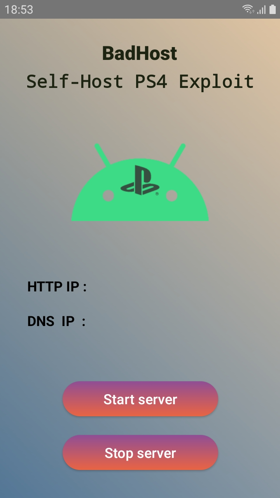

# BadHost
A self-host android app that includes HTTP,DNS servers.
### Credits : Al-azif for his awesome host and for all the help
#### Warning : this dns server does not block sony servers,i am not responsible if you get banned or your ps4 installs an update
  Best use case for this app is hosting the exploit offline/locally using android hotspot.  Requirements : this app requires root to bypass android\'s <1024 port restrictions mainly port 80 and 53. Android 8.1 Oreo and above.  How to :   1) Turn on Hotspot. 2) Make sure your Mobile data is off. 3) Press start server. 4) Connect Ps4 to Hotspot using manual DNS and enter the DNS ip shown on the app. 5) You can access the exploit using the guide menu or shortcuts like http://ab.c or http://the.gate or by entering the IP address in the browser.
 
 
#### Note : if you want to run it on wifi make sure that wifi does not have access to the internet

 
 